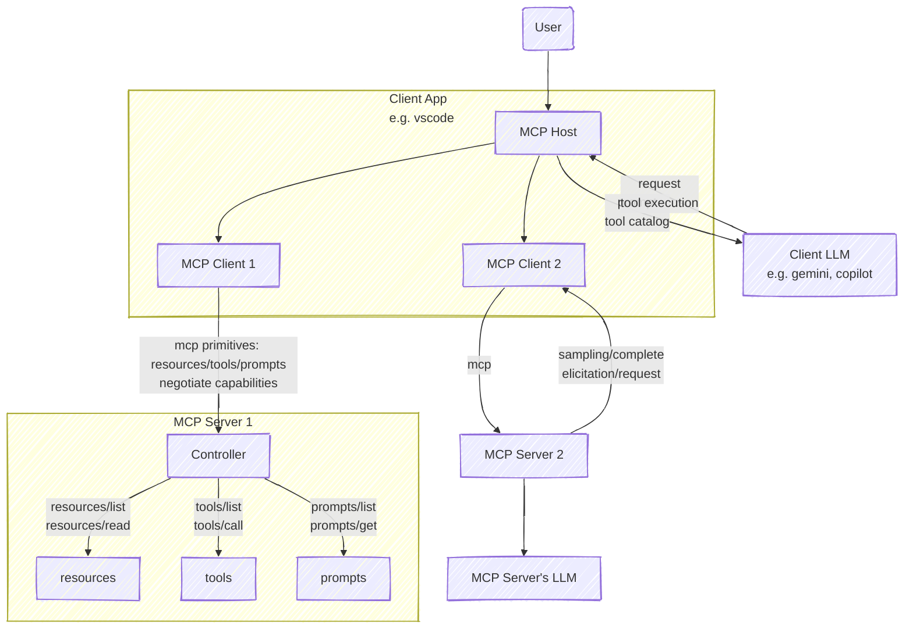

# Multi-Context Protocol

## Overview

- **MCP Host** can be standalone or embedded in another app / service (e.g. IDE, LLM UI, your in-house enterprise AI platform)
  - The Host is also what talks to the LLM (the model not the service) on your behalf.
- **MCP Clients** are spawned by the MCP Host to communicate with MCP servers. Typically automatically provisioned and managed by the Host app.
- What you do as an end-user is to configure your Host to talk to various MCP servers of your choice.
- **MCP servers** may run locally on your machine, on a server you manage, or provided by a commercial entity.

Note that:

- The LLM context will be much larger than simply prompting, since the LLM can request for more info without user input.
- Your data will still be sent to the LLM by the Host as part of its context. No special magic there to do otherwise. Safeguards against data leaks is the Host’s responsibility.

## Building MCP services

### Security

- Protecting end-user credentials and resoources access firstly is on the Host.
- The MCP services will need to validate user auth tokens (is this standardised?). The Host will need to know what auth tokens to store and how to send it to the MCP services, and inform/re-auth the user if necessary should access be denied.
- Possibly MCP servers meant to run locally will not implement any auth, and potentially has free access to your machine. It is possible for a malicious local MCP server to attack remote machines through yours. Be careful what you are running locally.

### Caching

- Similar to APIs, you may want to cache API responses to reduce network calls and improve performance.
