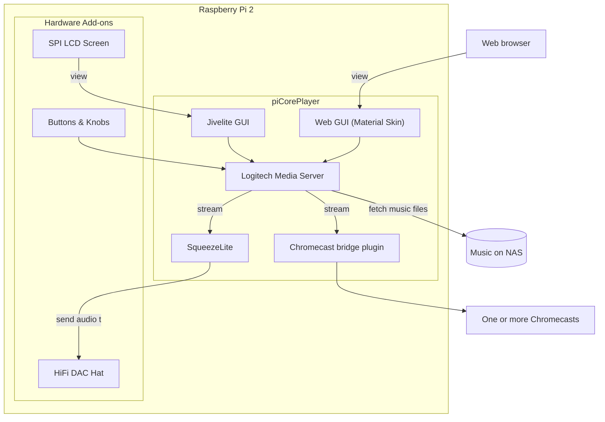

## Concept

I setup my Raspberry Pi 2 with piCorePlayer. Previously I was using Volumio, which was pretty nice too, but piCorePlayer looks more interesting to me so I wanted to try it out.

- Board: Raspberry Pi 2
- OS: piCorePlayer

### Roadmap

Got quite a few ideas for this build...

- [x] Hifi DAC Hat from Taobao: https://item.taobao.com/item.htm?spm=a1z09.2.0.0.3c052e8dYwoG66&id=564203353411&_u=v1qg627kd223 (same item on AliExpress: https://www.aliexpress.com/item/1005004050985603.html)
- [x] 3.5-inch LCD screen, displayed via Jivelite
- [ ] (partially done) Rotary encoders and buttons for navigating the LCD display
- [ ] Hardware power/shutdown button
- [ ] Hardware power off LCD backlight

### Illustration of My Current Setup



### Project repository

https://github.com/geksiong/piCorePlayer-mods

## piCorePlayer

piCorePlayer consists of a server and player:

- Player: Squeezelite - this is the component that plays audio on the speakers
- Server: Logitech Media Server - indexes and servers the music from various sources

You can actually install the player and server on separate devices. Multiple players can connect to a single LMS.

### Initial setup:

- Installed the LMS web interface. Default port is 9000.
- I mounted the music library from my Synology NAS, via CIFS interface.

piCorePlayer does not have the ability to stream music to the web browser. It is designed to output to loudspeakers.

Default SSH password: tc / piCore 


## Audio DAC

It's a HiFiBerry DAC clone. Configure in Squeezelite as HiFiBerry DAC Zero/MiniAMP. Sound is good.

- Realised only later that the location of the audio connectors are on the short side of the Pi, and there are no cases to accomodate them. Likely I'll have to place everything inside a DIY enclosure.

## LCD Screen via Jivelite

I used the same 3.5 inch LCD I used for RetroPie, and simply followed the instructions at https://docs.picoreplayer.org/projects/add-a-display/. Interestingly, I don't have to use the LCD-show repo - pCP seems to have support out of the box already. Framerate is probably not an issue here.

### Configuration

- You need to select the language the first time. The UI is a bit unintuitive. After selecting English language, just tap on the Back button to see the main screen.
- I accidentally set another language instead of English, but couldn't find a way to change the language.
  - The UI actually has an 'Advanced Settings' section where you can change the language. But then again, I wouldn't know how to get there in a language I don't know...
  - The nuke option is to go into the pCP web config and 'Reset' Jivelite which will clear all its configuration, then reboot. However, you will lose other settings such as the background, screensaver, etc.
- Other things to configure:
  - Wallpaper
  - Screensavers
  - "Now Playing" views
  - In "Settings" > "piCorePlayer", *deselect* "Enable Power On Button When Powered Off" (this allows you to "power off" the player, and then tap on the screen to turn it back on again)
- Jivelite doesn't save settings automatically. You need to go into "Settings" > "piCorePlayer" > "Save Settings to SD Card".

### Inverting the Display

- I decided to invert the display, and then the touchscreen threw me off as it wasn't inverted together with the display. To fix, change Jivelite to not autostart, recalibrate the touchscreen, and set Jivelite back to autostart again.


### Unicode Fonts

#### The Hard Way (My Way)

- Jivelite's fonts do not support CJK glyphs. To support CJK, follow the instructions at https://forums.slimdevices.com/showthread.php?103330-Jivelite-for-piCorePlayer/page20 to replace the fonts.

To summarise the steps:

- Ensure you have ssh access to piCorePlayer
- Get a unicode font e.g. Google Noto Sans, or Huawei's HarmonyOS Sans. I chose HarmonyOS Sans just to try it out, and I think it looks good so I'm keeping it.
- Create a directory `/mnt/mmcblk0p2/tce/fonts` (you could also just use `/mnt/mmcblk0p2/tce/optional` but I prefer to keep my custom hacks separate from the packages in there)
- scp the fonts to the above directory
- Create `/home/tc/replaceJiveliteFonts.sh` (the guide uses a different location) with the following contents (replace font names accordingly):

```sh
#!/bin/sh
cd /opt/jivelite/share/jive/fonts
sudo rm FreeSans.ttf
sudo rm FreeSansBold.ttf
sudo ln -s /mnt/mmcblk0p2/tce/fonts/HarmonyOS_Sans_SC_Regular.ttf FreeSans.ttf
sudo ln -s /mnt/mmcblk0p2/tce/fonts/HarmonyOS_Sans_SC_Bold.ttf FreeSansBold.ttf
```

- Make sure you `chmod 755 replaceJiveliteFonts.sh`
- From the web gui, under "Tweaks" > "User Commands", specify the path to this file `/home/tc/replaceJiveliteFonts.sh` so that pCP will run these commands on boot
- Reboot and ssh in again to verify the fonts are soft-linked correctly. Test with your choice of music file with the Unicode metadata.

#### The Easy Way (not tested)

Under the "Advanced" menu there is an "Applet Installer". One of the applets is a Font Replacer which is supposed to replace the font with a merged FreeSans + Droid Sans font. 

### Others

- The spectrum analyzer view seems unstable, however the music playback is not affected and LMS web page is still working fine. I realised later that this is due to VU Meters being incompatible with the Wav35Skin skin.
- "Power off" only powers off the LMS(?) service, not shutdown the Raspberry Pi! I don't think it's safe to pull the plug with this? 


### Now Playing: VU Meters

The VU Meters will not work out of the box. Need to install the VU Meter packages that end with 'wav35skin'. Even then, I found that only 'Logitech Black-wav35skin' works. Fortunately that one looks pretty good.

### Screensavers: Clock Applet

The Clock Applet is broken out of the box, but I finally found the "fix" at https://www.mail-archive.com/unix@lists.slimdevices.com/msg63028.html. Make a copy of `ClockApplet.lua` and add in 'Wav35Skin' in this part of the codes:

```lua
local function _isWQVGASkin(skinName)
    if skinName == 'WQVGAsmallSkin' or skinName == 'WQVGAlargeSkin' or skinName == 'Wav35Skin' then
         return true
    end
end
```

Basically the Clock Applet doesn't even know about the Wav35Skin. The hack here is to leverage on the existing WQVGASkin clock styles.

Make this change permanent similarly as the font replacement method - by changing the softlinks to your new file.

> However, doing this fixes the Digital Clock but breaks the Analog clock, so don't fix this if you prefer the analog clock...
> 
> Also, the Dot Matrix and Word Clocks are still broken.

**Update 2023-01-08:** Partially fixed the Analog and DotMatrix clocks. Word clock still not working. I'll just post the diff below for now:

`diff ClockApplet.lua /tmp/tcloop/pcp-jivelite/opt/jivelite/share/jive/applets/Clock/ClockApplet.lua`

```lua
--- ClockApplet.lua
+++ /tmp/tcloop/pcp-jivelite/opt/jivelite/share/jive/applets/Clock/ClockApplet.lua
@@ -62,7 +62,7 @@
 end

 local function _isWQVGASkin(skinName)
-    if skinName == 'WQVGAsmallSkin' or skinName == 'WQVGAlargeSkin' or skinName == 'Wav35Skin' then
+    if skinName == 'WQVGAsmallSkin' or skinName == 'WQVGAlargeSkin' then
        return true
     end
 end
@@ -81,12 +81,11 @@
                skinName = 'JogglerSkin'

        elseif _isWQVGASkin(skinName) then
-               -- skinName = "WQVGAsmallSkin"
-               skinName = "Wav35Skin"
+               skinName = "WQVGAsmallSkin"

        elseif _isHDSkin(skinName) then
                skinName = "HDSkin"
-
+
        end

     return "applets/" .. skinName .. "/images/"
@@ -980,7 +979,7 @@
 function DotMatrix:getDotMatrixClockSkin(skinName)

     -- 10' and 3'UIs send the same clock
-    if skinName == 'WQVGAlargeSkin' or skinName == 'Wav35Skin' then
+    if skinName == 'WQVGAlargeSkin' then
         skinName = 'WQVGAsmallSkin'
     end

```

**Update 2023-02-12:** More fixes to the Digital and Dot Matrix clocks (check out the project repo for latest codes). The Word Clock is still broken. There's also a Radial Clock that's currently missing.

I have no idea how to get a proper fix back to the maintainers...the project team seems to be using private repos for these parts.

### LCD Backlight (can't be turned off)

Jivelite actually comes with a brightness control but it works only for the official Pi LCD display. It would be nice if I can control the brightness on my 3.5-inch LCD. However, according to this [discussion here](https://tlfong01.blog/2020/03/15/tft-lcd-backlight-notes/) it's not possible because the display circuit didn't cater for this even though the chip is capable. So I can only do a so-called "Display Off" in Jivelite which is just a black screen.

There are apparently screens that has backlight control, but the GPIO may conflict with the DAC.

> **Lesson**: Get a HDMI LCD display. You'll get less fuss, more functionality, no potential for conflicts, and more GPIOs for knobs and buttons.

**Update 2023-06-06:** Found a possible way, not to turn off the LCD backlight, but to turn off the LCD completely.

- Physical pins 2 and 4 are the 5V power pins. By experimenting with physical connections, I found that only one of them is needed for the LCD to function, and I can disconnect/reconnect the power with no impact to the display. So if I place a transistor switch at pin 2, powered by one of the unused GPIO pins, I should be able turn on/off the LCD at will.
- I could disconnect both 3V3 pins (1 and 17) as well without impact to the operation.
- Of course, dimming is not an option with approach, but I just want to turn off the backlight to save power (and hopefully extend the LCD's life)

## Buttons and Rotary Encoders

I decided to add some physical controls to the setup. Someone has already written a guide here: https://docs.picoreplayer.org/projects/control-jivelite-by-rotary-encoders-and-buttons/. However, the guide has a very critical error which caused me to spend hours to troubleshoot. Turns out the sbpd command should be run in daemon mode with the `-d` parameter and that's missing from the guide. Also, those comments in the sbpd command shouldn't be in the actual script.

### Wiring

As I have both a DAC and LCD, this means most of the pins are used up. My DAC has pass through pins, and the LCD uses a 26-pin connector, I simply connected the LCD on top of the DAC. Following the guide above, this leaves only pins 29-34 free, just enough to wire up one push button and one rotary encoder (with push button).

The rotary encoder must be one without power. Basically the one without a breakout board, with 3 pins on one side and 2 pins on the other side.

My encoder pins are too soft to plug into a breadboard so I attach them with female-male jumper wires (not very secure).

My current GPIO pins layout are:

- pin 29 (GPIO 5): Rotary Up
- pin 31 (GPIO 6): Rotary Down
- pin 32 (GPIO 12): Rotary Button
- pin 33 (GPIO 13): Push Button

#### Resources

- https://www.hackster.io/hardikrathod/push-button-with-raspberry-pi-6b6928
- https://learn.adafruit.com/rotary-encoder/hardware

> **TODO**: I can probably squeeze in another rotary encoder (or more buttons), if I wire up the LCD using individual wires instead of directly using the LCD's onboard connector.

### Packages & Script

Following the guide:

- Install the `pcp-sbpd` package (this is the only one needed, it will pull in the `pigpio` package)
- Create the file `/home/tc/sbpd-script.sh`. Replace the actions with what you need:

```sh
#!/bin/sh

# start pigpiod daemon
pigpiod -t 0 -f -l -s 10

# wait for pigpiod to initialize - indicated by 'pigs t' exit code of zero

count=10 # approx time limit in seconds
while ! pigs t >/dev/null 2>&1 ; do
        if [ $((count--)) -le 0 ]; then
                printf "\npigpiod failed to initialize within time limit\n"
                exit 1
        fi
#       printf "\nWaiting for pigpiod to initialize\n"
        sleep 1
done
printf "\npigpiod is running\n"

# load uinput module - required to be able to send keystrokes
# then set the permission to group writable, so you don't need to run sbpd with root permissions
sudo modprobe uinput
sudo chmod g+w /dev/uinput

# The full list of Jivelite key commands can be found here:
# https://github.com/ralph-irving/tcz-lirc/blob/master/jivekeys.csv

# Button 1                                              # button-section, defines the GPIO and key-commands
SW1=13                                                  # GPIO (BCM, not Board)
SH1=KEY:KEY_LEFTBRACE                                   # key-command for SHORT press (Now Playing)
LO1=KEY:KEY_POWER                                       # key-command for LONG press (Power)
LMS1=250                                                # milliseconds for long press

# Button rotary 1
SW4=12
SH4=KEY:KEY_ENTER                               # key-command for SHORT press (Enter)
LO4=KEY:KEY_BACK                                # key-command for LONG press (Back)
LMS4=250

# Encoder Rotary 1
EN1_UP=5
EN1_DN=6
EN1_CMD=KEY:KEY_UP-KEY_DOWN

CMD="sbpd -d -f /home/tc/sbpd_commands.cfg \
b,$SW1,$SH1,2,0,$LO1,$LMS1 \
b,$SW4,$SH4,2,0,$LO4,$LMS4 \
e,$EN1_UP,$EN1_DN,$EN1_CMD,4"

echo $CMD
$CMD > /dev/null 2>&1 &
```

  - Use the key names documented here: https://github.com/ralph-irving/tcz-lirc/blob/master/jivekeys.csv (I think they work because LIRC is provided by default).
  - You can also supply a `sbpd_commands.cfg` file to contain aliases for the keys. This is not really needed.
  - For more information, checkout sbpd's GitHub repository: https://github.com/coolio107/SqueezeButtonPi-Daemon
- Make the script executable: `sudo chmod +x /home/tc/sbpd-script.sh`
- In the pCP web GUI, go to "Main" > "Tweaks" and set "User Commands" to run the script on boot.

### Notes

- The encoder doesn't always register. This is actually documented at sbpd's GitHub repo.

## LMS Plugins

Note: I'm not sure how many plugins I can safely install. I had some wonky behaviour once and had to re-install LMS and re-setup from scratch (the LMS not the entire pCP). I decided to remove all plugins that I definitely don't need just in case.

### YouTube

- Follow the instructions at https://github.com/philippe44/LMS-YouTube to get a YouTube API Key
- Seems to work well
- This plugin works best from the web GUI. Manually add your YouTube urls to a playlist.

### AirPlay

- Didn't seem to work well from my Mac, so I decided to uninstall it.


### ChromeCast

- It took some fiddling before I realised I should save settings before trying anything further.
- I selected the 'squeeze2cast-linux-arm' binary.
- After that it's pretty much autoscan. No further settings required.
- It managed to detect both my old ChromeCast Audio (too bad it's discontinued), and the Chromecast on my Xiaomi TV Box.
- The way to use this is to go into 'Settings > Player > Synchronise' and select the Chromecast player you wish to sync with.
- Volume can be separately controlled for each device.
- On the Material Skin GUI, you can click on the Raspberry Pi icon on the top left to quickly manage the synchronised devices.

### Other plugins

I also installed the following plugins:

- Podcasts
- Music and Artist Information
- What was that Tune?

The following plugins I haven't used yet but look interesting:

- SqueezeboxEQ - equaliser
- SqueezeCloud - integration with SoundCloud
- SqueezeESP32 - hardware based on ESP32
