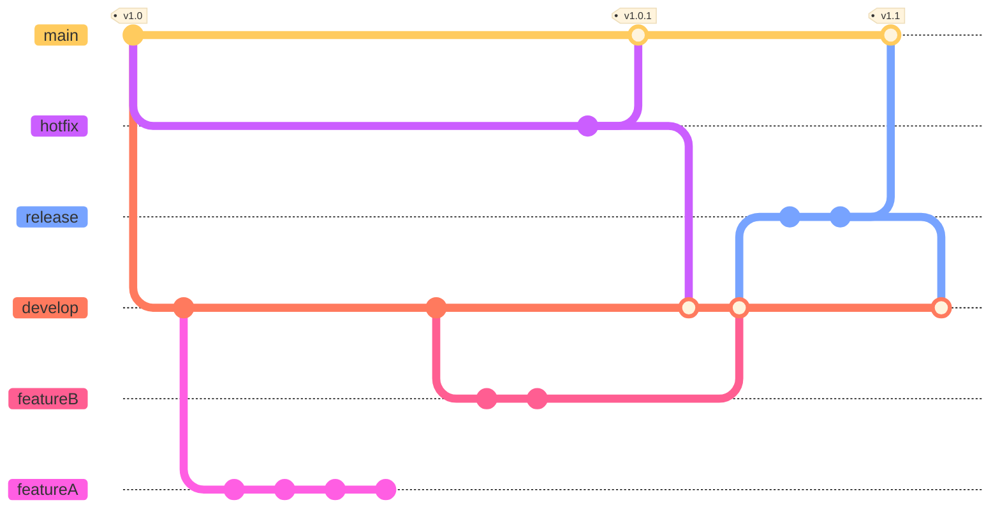

# Git Branching Strategies

## GitFlow

GitFlow uses multiple branches to manage the source code. The 'main' and 'develop' branches are the two primary branches that live throughout the development lifecycle.

### GitFlow Branches

- **main**: All production codes. When codes in 'develop' branch is ready for release, they are merged to the 'main' branch.
- **develop**: All development happens here.
- **feature-\***: used to develop new features. Always branched off from the 'develop' branch.
- **hotfix-\***: quick fixes to deal with issues in production. Usually branches off from 'main' branch, and merged to both 'main' and 'develop' branches.
- **release-\***: interim branch to aggregate all fixed and features in preparation for production release. Branched off from 'develop' branch and merge to both 'main' and 'develop'.

## GitFlow Advantages

- Separate branches with proper naming convention and clearly-defined purposes
- Good for enterprise customers who need to adhere to release processes
- Good for handling different versions of production code (e.g. products, microservices)

## GitFlow Disadvantages

- Git history can be messy from all the branching and merging (rebasing your changes before pushing can help a bit)
- CI/CD integration may be complicated as branch names change
- A bit overkill when there is only a single production version (e.g. mobile app, websites)
- Cognitive overhead for developers as they context switch between branches
- Tendency to encourage long-lived branches and late integration

## Trunk-Based Development (TBD)

Trunk-Based Development was made popular by Google (who is also famous for using mono-repo approach rather than poly-repo).

In Trunk-Based Development, all developers commit and push their changes directly into the 'main' branch (known the as 'trunk'). This is done frequently (at least once a day). The 'main' branch is always in a releasable state.

The idea here is that frequent integration enables developers to immediately react to and resolve any conflicts immediately.

> Note: This is similar to what we used to do in pre-Git days (i.e. days of CVS/SVN, when branches are expensive)

### Feature Flags

Instead of feature branching, TBD typically use **feature flags** to manage the features-in-development by various teams in the 'main' trunk. Different teams can toggle on/off portions of code for the build process, and deploy only necessary code to production.

### Feature & Hotfix Branches in TBD?

Even with feature flags, it can still be difficult to keep track of what's going on across the various features. Some articles propose that larger teams may benefit from maintaining feature / hotfix branches.

Instead of committing to main, developers commit to the respective feature or hotfix branch, and submit pull requests when ready. The codes are verified and tested (perhaps with assistance from CI/CD automation)

> Note: As with GitFlow, once we introduce feature branching, there is a tendency towards long-lived branches. In my opinion, allowing feature branches in TBD goes again the single-trunk principle. Anyway, feature toggles or feature branches, the important principle to remember is keep 

### Releasing to Production in TBD

Even though the ideal is to keep the trunk always releasable, it may be the case that not everything in the trunk is actually releasable. In the TBD literature, the features are actually **cherry-picked** into a release branch, which is then eventually deployed.

### Squashing Commits

Another thing that is not often mentioned, is that in the TBD literature, the developer's git commits are to be **squashed first** before pushing it to trunk... No one is interested to know your local challenges and relevations, only in the final change. Also, squashing commits enable the **git history to be flat**, instead of the mess of merges that you often see in the GitFlow approach.

> This requires a high level of discipline on the part of the developer.

### TBD Advantages

- True continuous integration as the trunk is always updated with the latest codes
- Easier to integrate with CI/CD tools
- Shorter feedback loops. Minimum code conflicts. Faster release cycles

### TBD Disadvantages

- Not recommended for non-experienced developers
- Feature flags can become a mess to manage

## Others

To be covered in future:

- GitHub Flow
- GitLab Flow
- Environment Branching

---
Sources:
- https://www.bmc.com/blogs/devops-branching-strategies/
- https://www.atlassian.com/git/tutorials/comparing-workflows/gitflow-workflow
- https://trunkbaseddevelopment.com/
