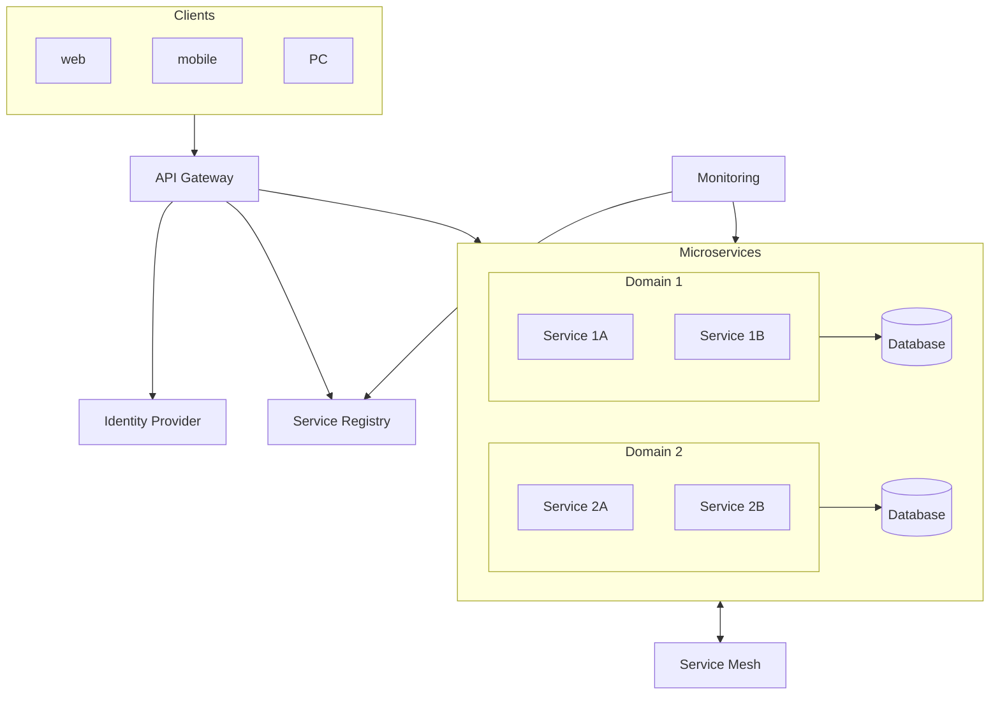

```mermaid
flowchart

subgraph clients[Clients]
  direction TB
  web
  mobile
  PC
end

api_gateway[API Gateway]

clients --> api_gateway

subgraph svcs[Microservices]
  direction LR
  subgraph dom1[Domain 1]
    svc1a[Service 1A]
    svc1b[Service 1B]
  end

  
  subgraph dom2[Domain 2]
    svc2a[Service 2A]
    svc2b[Service 2B]
  end

  
  dom1 --> db1[(Database)]
  dom2 --> db2[(Database)]
end

mesh[Service Mesh]
svcs <--> mesh

api_gateway --> svcs
api_gateway --> idp[Identity Provider]
api_gateway --> registry[Service Registry]

monitor[Monitoring] --> svcs
monitor --> registry[Service Registry]


```
