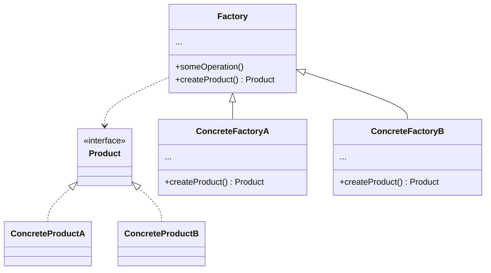

```mermaid
classDiagram

class Factory {
  ...
  +someOperation()
  +createProduct() Product
}

class Product
<<interface>> Product


class ConcreteFactoryA {
  ...
  +createProduct() Product
}

class ConcreteFactoryB {
  ...
  +createProduct() Product
}


class ConcreteProductA

class ConcreteProductB


Factory <|-- ConcreteFactoryA
Factory <|-- ConcreteFactoryB

Factory ..> Product

Product <|.. ConcreteProductA
Product <|.. ConcreteProductB

```
